**Cross-Modal Generative Alignment for Document, Chart, and Image Reasoning with Explanation-Aware Vision-Language Models**

**Bachelor's Thesis Proposal**

*Submitted by:*  
*Kamran Valijonov*  
*BSc Program - [Program Name]*  
*[University Name]*

Supervisor: [Prof. Name]  
Second Supervisor: [TBD]  
Date: 2026-06-06 (revised)

---

# Table of Contents

1. Target Publication Venue
2. Abstract
3. Introduction and Background
4. Problem Statement
5. Research Objectives
6. Research Questions
7. Theoretical Framework
8. Methodology
   - 8.1 Data Sources
   - 8.2 Preprocessing and Prompt Construction
   - 8.3 Model Design
   - 8.4 Training Objectives
   - 8.5 Evaluation Metrics
   - 8.6 Tools and Infrastructure
   - 8.7 Stepwise Methodology per Research Question
9. Research Timeline
10. Expected Contributions
11. Expected Results and Figure Placeholders
12. References
13. Appendix

---

# Target Publication Venue

The intended publishable output is a journal-style paper for **Information Fusion** or a closely related venue in multimodal learning and applied machine intelligence. The work fits that direction because it studies how visual evidence, language generation, rationale supervision, and parameter-efficient adaptation interact inside vision-language models.

The proposal does not aim to promise a leaderboard-scale system. The intended contribution is a controlled, resource-constrained study: the same pipeline is used wherever possible, the training objective is changed deliberately, and the resulting claims are tied to answer accuracy, rationale quality, evidence sensitivity, model scale, and transfer.

The planned paper therefore fits the venue along four axes:

- **Cross-modal fusion:** images, documents, charts, and questions are converted into a shared multimodal input format.
- **Objective comparison:** answer-only, rationale-generative, explanation-aware, and BLIP-2 contrastive-enhanced variants are compared under a fixed-budget protocol.
- **Evidence sensitivity:** masking diagnostics test whether answer likelihood changes when visual evidence is removed.
- **Practical adaptation:** QLoRA keeps the experiments realistic for a single-GPU bachelor-level research setting.

---

# Abstract

Vision-language models are now used to answer questions about documents, charts, science diagrams, and natural images. For this kind of reasoning, answer accuracy alone is not enough. If a model generates a rationale, that rationale should also be evaluated separately from the final answer, and the model should be tested for sensitivity to visual evidence. This thesis proposes a controlled study of cross-modal generative alignment for document, chart, and image reasoning with explanation-aware vision-language models.

The study uses a resource-constrained pipeline rather than comparing unrelated systems. It evaluates BLIP-2 OPT-2.7B generative fine-tuning and BLIP-2 contrastive-enhanced fine-tuning on ScienceQA, and it evaluates Qwen2-VL-2B with answer-only, rationale-generative, explanation-aware, and length-aware explanation objectives. ScienceQA and A-OKVQA are used for rationale-supervised experiments because they provide gold rationales. ChartQA, DocVQA, and a VQAv2 subset are treated as answer-only fallback and transfer/domain datasets unless a future experiment adds separate rationale supervision. Qwen2-VL-7B is used only for a scale check under the selected explanation-aware QLoRA setting.

The evaluation reports each dataset's native headline metric, rationale overlap metrics where gold rationales exist, BLIP-2 retrieval diagnostics for the contrastive branch, split/leakage checks, approximate uncertainty estimates, masking-based evidence sensitivity, and cross-domain transfer. The expected contribution is not the claim that explanation-aware training always wins. Instead, the thesis asks when rationale supervision helps, when answer-only training is stronger, whether contrastive BLIP-2 alignment improves beyond generative BLIP-2 fine-tuning, how visual evidence sensitivity behaves across domains, and whether a larger Qwen2-VL backbone changes the same QLoRA setup.

---

# Introduction and Background

Cross-modal reasoning is the ability of a model to use visual information and language together. A model may need to read a document field, compare bars in a chart, reason over a science diagram, or answer a commonsense question about an image. Modern vision-language models usually solve this by connecting a vision encoder to a language model through an alignment mechanism. That mechanism can be a projection layer, a Q-Former, cross-attention, or a more model-specific visual token interface.

The important question for this thesis is not only which model is strongest. The more useful question is what the alignment and training objective are doing. A contrastive objective learns a representation where matching images and text are close. A generative objective trains the model to produce answer text. An explanation-aware objective trains the model to produce a rationale and an answer, or to weight rationale and answer spans differently during loss computation. These objectives are related, but they do not test the same behavior.

This distinction matters because a correct answer is not always a grounded answer. A model can guess from language priors, copy a common answer pattern, or write a plausible explanation after the fact. Documents and charts make this problem especially visible because the evidence often appears as text, numbers, axes, legends, or table-like structure inside the image. ScienceQA and A-OKVQA are useful because they include rationales, while DocVQA, ChartQA, and VQAv2 are useful for domain behavior and transfer even when they do not provide gold rationales for explanation-aware supervision.

The thesis therefore frames alignment as a controlled experimental problem. The same pipeline converts examples into image, question, answer, and optional rationale fields. The same evaluation code is reused wherever possible. Each result is interpreted according to the available supervision: rationale-bearing datasets can test explanation-aware training directly; no-rationale datasets are reported as answer-only fallback/domain-transfer runs.

---

# Problem Statement

Current vision-language models can produce strong answers, but three issues remain important for controlled research:

- **Objective ambiguity.** Many papers change the model, data, training size, and objective at the same time. When the score improves, it is hard to tell whether the objective helped or whether a larger model or different data caused the gain.
- **Rationale uncertainty.** A generated explanation may sound good without proving that the model used the visual evidence. Rationale quality and evidence sensitivity must therefore be measured separately.
- **Domain dependence.** A method that works on natural images may behave differently on documents, charts, science diagrams, and commonsense image questions.

The central research problem is:

> How should resource-constrained vision-language models be aligned when the goal is accurate and visually grounded reasoning across document, chart, science, commonsense, and natural-image tasks?

This problem requires a controlled comparison of objectives, careful separation of rationale-supervised and answer-only datasets, and evaluation that does not confuse answer accuracy with faithful visual grounding.

---

# Research Objectives

This research pursues the following objectives:

1. Build a concise taxonomy of vision-language alignment methods, with emphasis on contrastive, generative, and explanation-aware training.
2. Compare BLIP-2 generative fine-tuning with BLIP-2 contrastive-enhanced fine-tuning under the same ScienceQA setup.
3. Compare Qwen2-VL answer-only, rationale-generative, explanation-aware fixed-alpha, and length-aware explanation objectives on datasets with gold rationales.
4. Report domain-level behavior for DocVQA, ChartQA, ScienceQA, A-OKVQA, and VQAv2 while clearly marking which datasets support rationale supervision and which are answer-only fallback runs.
5. Evaluate evidence sensitivity through image-masking drift instead of treating masking as direct proof of rationale faithfulness.
6. Check how the selected explanation-aware QLoRA setup changes when moving from Qwen2-VL-2B to Qwen2-VL-7B.
7. Produce reproducible artifacts: configs, logs, figures, tables, split/leakage audits, sample traces, and claim-to-evidence mapping.

---

# Research Questions

This thesis is guided by seven research questions:

1. **RQ1** - How have vision-language alignment methods evolved for grounded visual reasoning and explanation generation?
2. **RQ2** - How does BLIP-2 generative fine-tuning compare with BLIP-2 contrastive-enhanced fine-tuning on visual reasoning?
3. **RQ3** - Does explanation-aware fine-tuning improve answer accuracy and explanation quality on datasets with gold rationales?
4. **RQ4** - How does the same fine-tuning framework perform across document, chart, science, commonsense, and natural-image domains?
5. **RQ5** - How sensitive are the model's answers to visual evidence under image-masking perturbations?
6. **RQ6** - How does the selected explanation-aware QLoRA setup scale from Qwen2-VL-2B to Qwen2-VL-7B?
7. **RQ7** - How well do fine-tuned adapters transfer across visual domains and prompt formats?

Outside this list, the paper will discuss these questions in normal section language rather than repeatedly labeling every paragraph with RQ numbers.

---

# Theoretical Framework

The theoretical foundation of the thesis combines five ideas:

- **Contrastive alignment.** CLIP-style learning creates a shared image-text space by pulling matched image-text pairs together and pushing mismatched pairs apart. In this thesis, contrastive alignment is tested only in the BLIP-2 branch because BLIP-2 has a Q-Former representation that can be adapted for image-answer contrastive diagnostics.
- **Generative alignment.** BLIP-2 and Qwen2-VL can be fine-tuned to generate answer text from an image and question. Generative supervision directly trains the output behavior.
- **Rationale supervision.** ScienceQA and A-OKVQA provide rationales, so they can support rationale-generative and explanation-aware objectives. This is not assumed for ChartQA, DocVQA, or VQAv2.
- **Parameter-efficient fine-tuning.** LoRA and QLoRA make it possible to adapt billion-parameter models under a realistic single-GPU budget while keeping most model weights frozen or quantized.
- **Evidence sensitivity.** Image masking tests whether answer likelihood changes when visual evidence is perturbed. This is treated as a diagnostic of evidence sensitivity, not as automatic proof that the generated rationale is faithful.

The thesis treats alignment strategies as objective-level choices, rationale supervision as a supervision-level choice, and QLoRA as a compute-budget choice. The main value comes from keeping these choices explicit instead of mixing them into one broad "model improvement" claim.

---

# Methodology

## 8.1 Data Sources

The study uses five public benchmarks:

- **DocVQA** - document-image question answering; used as an answer-only fallback and transfer/domain dataset.
- **ChartQA** - chart question answering with numerical and logical reasoning; used as an answer-only fallback and transfer/domain dataset.
- **ScienceQA** - multimodal science questions with gold rationales; used for rationale-generative and explanation-aware experiments.
- **A-OKVQA** - commonsense visual question answering with rationales; used as a second rationale-bearing domain.
- **VQAv2 subset** - natural-image VQA subset; used as an answer-only fallback and transfer/domain dataset.

The key methodological rule is that rationale-supervised claims are made only where gold rationale supervision exists. ChartQA, DocVQA, and VQAv2 are valuable for domain and transfer behavior, but they are not treated as gold-rationale explanation-aware datasets.

## 8.2 Preprocessing and Prompt Construction

Each dataset is converted into a shared example format:

- image or visual document,
- question,
- answer choices when available,
- gold answer,
- optional gold rationale,
- dataset and split metadata.

The pipeline builds prompt families from this shared format:

- **Answer-only prompt:** target contains only the answer.
- **Rationale-generative prompt:** target contains rationale text followed by answer text under natural token-level cross-entropy.
- **Explanation-aware prompt:** target contains rationale and answer, but the loss separates rationale and answer spans and weights them with alpha.
- **Answer-only fallback prompt:** used when a dataset has no gold rationale.

The notebook also records sample traces showing the raw example, prompt text, target text, tokenization, supervised spans, collator output, generated text, parsed answer, and metric calculation.

## 8.3 Model Design

The study uses two backbone families:

- **Qwen2-VL-2B-Instruct** as the primary resource-constrained model.
- **Qwen2-VL-7B-Instruct** for the selected scale check under the same explanation-aware QLoRA setup.
- **BLIP-2 OPT-2.7B** for the controlled generative versus contrastive-enhanced comparison.

The Qwen2-VL runs use QLoRA adapters. The visual encoder is frozen, and the adapter target modules are kept consistent across runs unless a run explicitly records a change. The BLIP-2 contrastive branch keeps the vision tower and OPT language model frozen and trains Q-Former-side alignment components needed for the generative and contrastive objectives.

## 8.4 Training Objectives

The planned objective families are:

- **Zero-shot reference:** evaluate the pretrained model before task fine-tuning.
- **Answer-only fine-tuning:** train only on answer targets.
- **Rationale-generative fine-tuning:** train on rationale-plus-answer targets using natural token-level cross-entropy.
- **Explanation-aware fixed-alpha fine-tuning:** separate answer and rationale spans and weight them with a fixed alpha.
- **Length-aware explanation control:** derive the effective alpha from answer and rationale token counts, with an optional answer-weight multiplier.
- **BLIP-2 contrastive-enhanced fine-tuning:** add an image-answer InfoNCE term to the BLIP-2 generative objective.

The fixed-alpha sweep is treated as an ablation. The length-aware objective is treated as an audit/control for the natural token-weighted setting, not automatically as the main explanation-aware method.

## 8.5 Evaluation Metrics

The evaluation separates answer quality, rationale quality, retrieval behavior, evidence sensitivity, scale, and transfer:

- **Headline metric:** each dataset's native primary metric.
  - ScienceQA and A-OKVQA: multiple-choice accuracy.
  - ChartQA: relaxed accuracy, with exact match as a secondary metric.
  - DocVQA: ANLS, with exact match as a secondary metric.
  - VQAv2 subset: VQA consensus accuracy where available, with exact match as a secondary metric.
- **Rationale quality:** BLEU and ROUGE-L only where gold rationales exist.
- **BLIP-2 retrieval diagnostic:** R@1, R@5, R@10, and MRR for frozen, generative, contrastive-enhanced, and random controls.
- **Evidence sensitivity:** masking drift, defined as the change in gold-answer likelihood after a visual region is masked.
- **Uncertainty:** approximate confidence intervals for capped accuracy-style evaluations.
- **Split integrity:** selected IDs and train/evaluation overlap checks where stable IDs are available.
- **Transfer:** train-domain versus target-domain matrix, interpreted within each target metric column.

The study does not claim to run full human evaluation, POPE/CHAIR hallucination benchmarks, attention-alignment faithfulness, full fine-tuning, multi-seed SOTA benchmarking, or teacher-generated rationale supervision for no-rationale datasets.

## 8.6 Tools and Infrastructure

- **Languages and frameworks:** Python, PyTorch, Hugging Face `transformers`, `datasets`, `peft`, `accelerate`, and `bitsandbytes`.
- **Fine-tuning:** QLoRA with 4-bit quantization for Qwen2-VL runs.
- **Evaluation and artifacts:** notebook-driven pipeline that writes tables, figures, logs, sample traces, split/leakage audits, and claim-to-evidence maps.
- **Compute target:** one strong Colab Pro+ GPU where possible; A100 for the Qwen2-VL-7B scale run if needed.
- **Visualization:** matplotlib/seaborn-style figures for paper-ready results and placeholder proposal figures for planning.

## 8.7 Stepwise Methodology per Research Question

**RQ1 - Literature and taxonomy.** Review the closest VLM alignment, document/chart reasoning, rationale, hallucination, and efficient adaptation work. Summarize the gap as controlled objective comparison under fixed compute.

**RQ2 - BLIP-2 generative versus contrastive-enhanced.** Train or refresh BLIP-2 generative and BLIP-2 contrastive-enhanced ScienceQA runs under the same data cap and compare accuracy plus retrieval diagnostics against frozen and random controls.

**RQ3 - Explanation-aware training.** On ScienceQA and A-OKVQA, compare answer-only, rationale-generative, fixed-alpha explanation-aware, and length-aware controls. Report answer accuracy and rationale metrics separately.

**RQ4 - Domain-level behavior.** Run the same framework on ScienceQA, A-OKVQA, ChartQA, DocVQA, and VQAv2. Mark ChartQA, DocVQA, and VQAv2 as answer-only fallback domains rather than rationale-supervised datasets.

**RQ5 - Evidence sensitivity.** Apply image-masking perturbations and measure masking drift. Save readable masking examples showing the original image, masked image, question, gold answer, full-image score, masked score, and drift.

**RQ6 - Scale check.** Compare Qwen2-VL-2B and Qwen2-VL-7B under the same selected explanation-aware QLoRA setup. Report answer accuracy and rationale-overlap metrics, without claiming a full efficiency Pareto study.

**RQ7 - Transfer.** Evaluate fine-tuned source adapters on other target domains and prompt formats. Interpret the transfer matrix by target column because each domain uses its own metric.

---

# Research Timeline

The research is planned over a 50-day period, from 2026-04-16 to 2026-06-05.

| Milestone | Duration | Period |
| --- | --- | --- |
| Literature review and taxonomy | 1 week | 2026-04-16 to 2026-04-22 |
| Dataset normalization and sample-trace pipeline | 1 week | 2026-04-23 to 2026-04-29 |
| Qwen2-VL-2B answer-only and rationale-generative controls | 1 week | 2026-04-30 to 2026-05-06 |
| BLIP-2 generative and contrastive-enhanced runs | 1 week | 2026-05-07 to 2026-05-13 |
| Explanation-aware alpha sweep and length-aware controls | 1 week | 2026-05-14 to 2026-05-20 |
| Domain, masking, scale, and transfer analyses | 1 week | 2026-05-21 to 2026-05-27 |
| Paper writing, figure cleanup, validation, and defense preparation | 9 days | 2026-05-28 to 2026-06-05 |

---

# Expected Contributions

The expected contributions are:

- A controlled taxonomy and literature framing of contrastive, generative, and explanation-aware VLM alignment.
- A BLIP-2 objective comparison that separates generative fine-tuning from contrastive-enhanced fine-tuning.
- A Qwen2-VL comparison of answer-only, rationale-generative, explanation-aware fixed-alpha, and length-aware rationale training on rationale-bearing datasets.
- A domain-level analysis that clearly distinguishes rationale-supervised domains from answer-only fallback domains.
- A masking-based evidence-sensitivity analysis with saved visual examples.
- A Qwen2-VL-2B versus Qwen2-VL-7B scale check under the same QLoRA objective.
- A transfer matrix across visual domains and prompt formats.
- A reproducible artifact set suitable for a bachelor-level research paper: code, configs, logs, generated tables, generated figures, sample traces, split audits, and claim-to-evidence mapping.

---

# Expected Results and Figure Placeholders

The figures in this proposal are still planning/dummy figures. They are kept as visual placeholders for the proposal document and should not be treated as the final paper figures.

## RQ1 - Evolution and taxonomy of vision-language alignment

**Expected result.** The literature review should show a transition from contrastive image-text representation learning toward generative and instruction-tuned VLMs, with recent work adding reasoning, critique, text-rich images, and efficient adaptation. The thesis contribution is positioned as a controlled objective comparison under limited compute.

### Figure 1.1 - Taxonomy of Vision-Language Alignment Methods

This placeholder taxonomy classifies VLM families by objective, alignment mechanism, and training style. In the final paper, the taxonomy is summarized in prose and a literature comparison table.

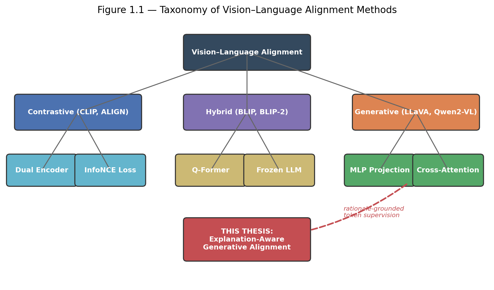

### Figure 1.2 - Timeline of Vision-Language Alignment Milestones

This placeholder timeline gives the proposal a visual overview of the field. The final paper uses this idea in the literature review rather than relying on the exact dummy numbers shown here.

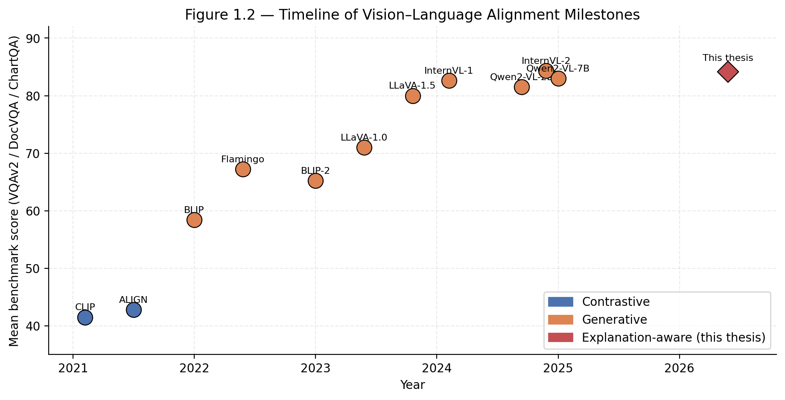

## RQ2 - BLIP-2 generative versus contrastive-enhanced alignment

**Expected result.** The contrastive-enhanced BLIP-2 run may improve image-answer representation learning, but the paper will only claim an improvement if the answer accuracy and retrieval diagnostics support it. The comparison is within BLIP-2 on ScienceQA, not across all datasets and not on Qwen2-VL.

### Figure 2.1 - BLIP-2 Objective Comparison Placeholder

This placeholder stands for the final BLIP-2 generative versus contrastive-enhanced result figure. The final paper should compare both trained variants against the frozen BLIP-2 reference.

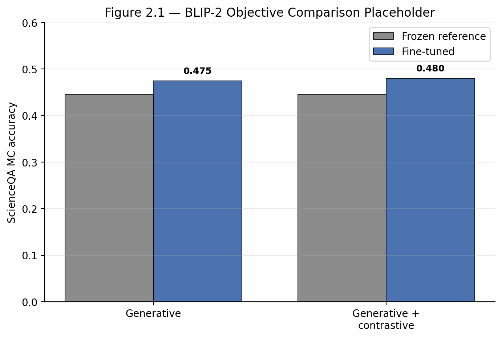

### Figure 2.2 - BLIP-2 Retrieval Diagnostic Placeholder

This placeholder stands for the final retrieval diagnostic. The final figure should include frozen BLIP-2, BLIP-2 generative, BLIP-2 contrastive-enhanced, and a random-rank control.

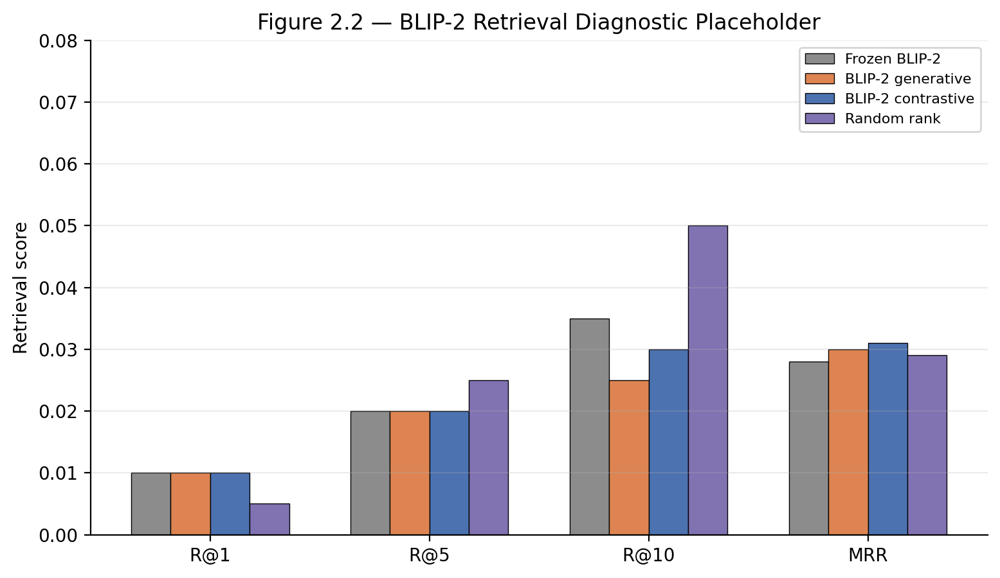

## RQ3 - Explanation-aware training on gold-rationale datasets

**Expected result.** Explanation-aware training is expected to be useful but not automatically better than answer-only or rationale-generative training. The main comparison must include the true answer-only control, the rationale-generative control, the fixed-alpha explanation-aware run, and the length-aware control.

### Figure 3.1 - Controlled Strategy Comparison Placeholder

This placeholder represents the final comparison of zero-shot, answer-only, rationale-generative, explanation-aware, and length-aware controls for ScienceQA and A-OKVQA.

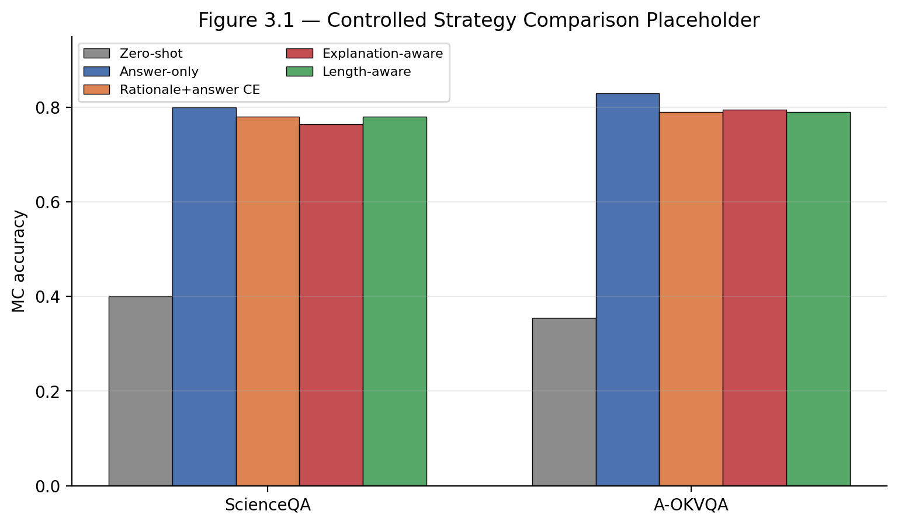

### Figure 3.2 - Alpha and Rationale Quality Placeholder

This placeholder represents the explanation-aware alpha sweep and rationale-quality diagnostics. It is not a human-rating figure in the final scope.

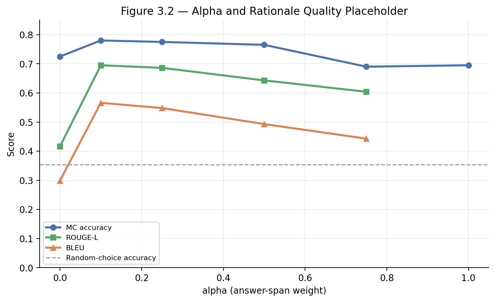

## RQ4 - Domain-level behavior

**Expected result.** The same framework should behave differently across document, chart, science, commonsense, and natural-image tasks. However, domain-level results must be interpreted carefully because ScienceQA and A-OKVQA are rationale-supervised, while ChartQA, DocVQA, and VQAv2 are answer-only fallback domains.

### Figure 4.1 - Domain-Level Adaptation Placeholder

This placeholder represents the final domain-level adaptation figure. It should not be interpreted as an ablation heatmap over architecture factors unless those ablations are actually run.

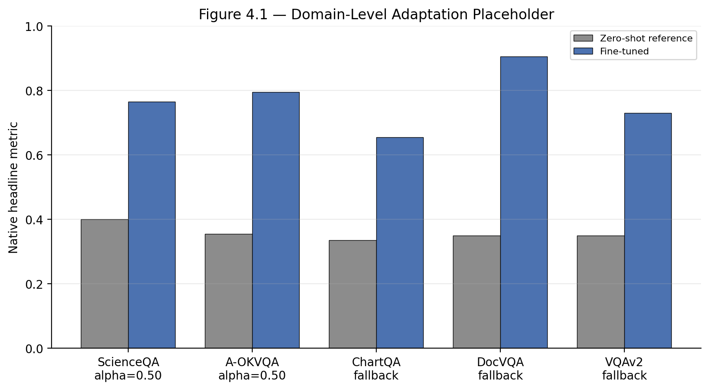

### Figure 4.2 - Pipeline Diagnostic Placeholder

This placeholder represents the notebook/pipeline diagnostics that show dataset samples, prompt construction, tokenization, supervised spans, generated outputs, and metric calculation.

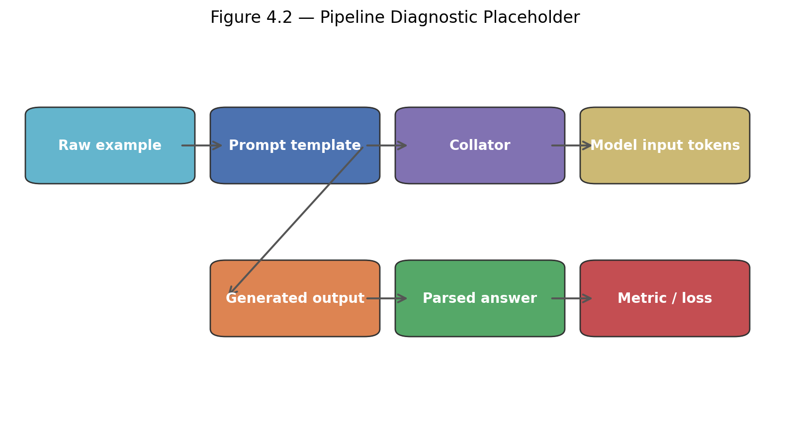

## RQ5 - Evidence sensitivity under masking

**Expected result.** Masking drift should show whether the model's answer score changes when parts of the image are removed. This is evidence sensitivity, not proof that a generated rationale is faithful. Structured domains such as documents and charts may show stronger drift because evidence is more localized.

### Figure 5.1 - Evidence-Masking Drift Placeholder

This placeholder represents the final masking drift plot across completed runs.

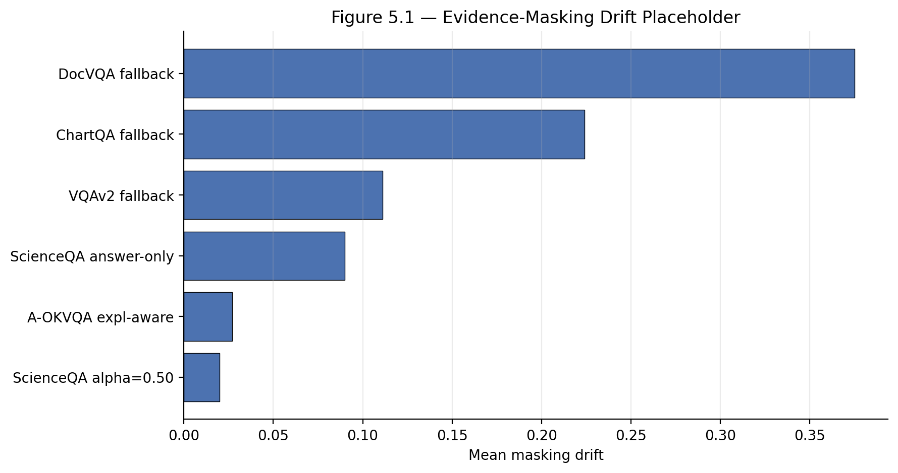

### Figure 5.2 - Masking Example Placeholder

This placeholder represents saved masking examples: original image, top-drift mask, random mask, blank-image control, question, answer, full-image score, masked score, and drift.

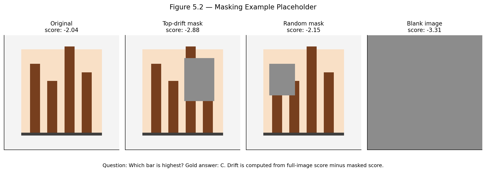

## RQ6 - QLoRA scale check

**Expected result.** The Qwen2-VL-7B run is expected to improve over Qwen2-VL-2B under the same selected explanation-aware QLoRA setup. This is a scale check, not a full comparison of every objective at every scale and not a full fine-tuning versus QLoRA Pareto study.

### Figure 6.1 - Efficiency Context Placeholder

This placeholder is retained only as planning context. The final paper should not claim a full efficiency Pareto front unless wall-clock, memory, and strategy-comparison data are actually collected.

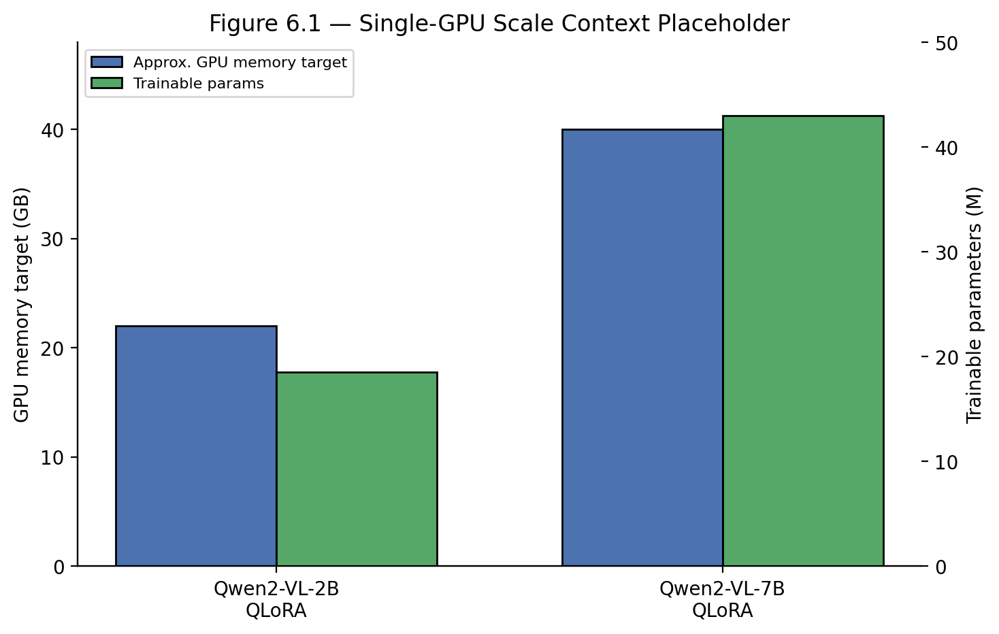

### Figure 6.2 - Qwen2-VL 2B versus 7B Scale Placeholder

This placeholder represents the final 2B versus 7B comparison under the same explanation-aware QLoRA setting.

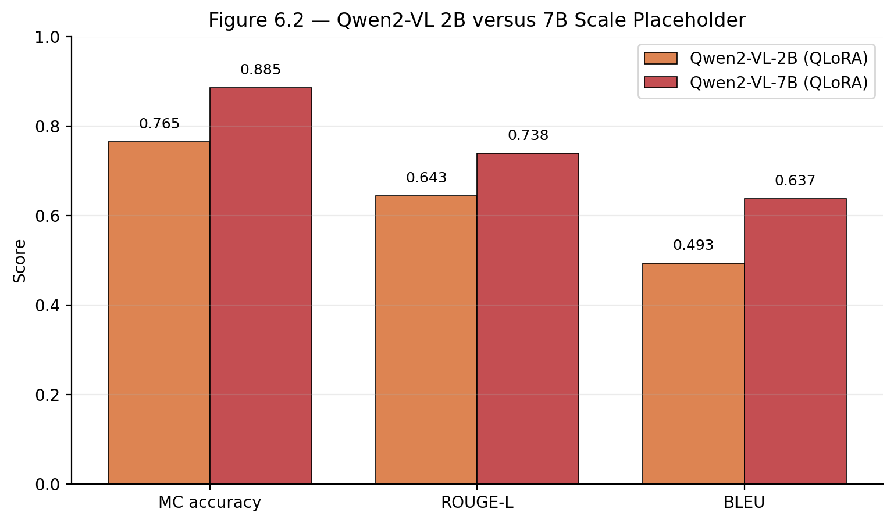

## RQ7 - Cross-domain transfer

**Expected result.** Transfer is expected to be target-specific and objective-specific. The transfer table should compare answer-only, rationale-generative, and explanation-aware sources separately where those controls exist. Each target column must be interpreted using that target dataset's native metric.

### Figure 7.1 - Cross-Domain Transfer Matrix Placeholder

This placeholder represents the final train-domain versus test-domain transfer heatmap.

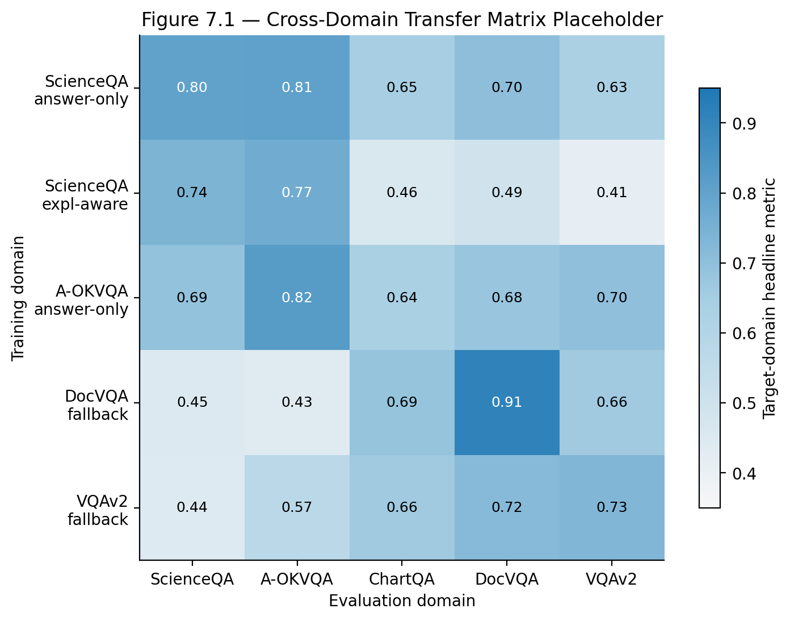

### Figure 7.2 - Optional Transfer Stability Placeholder

This placeholder is retained for proposal completeness, but sequential catastrophic forgetting is not part of the final main-scope claim unless a separate experiment is run.

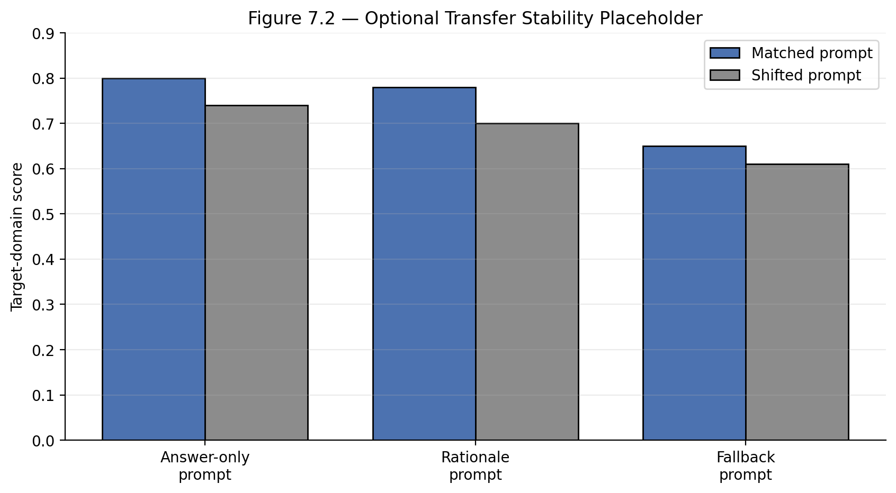

---

# References

Antol, S. et al. (2015). *VQA: Visual Question Answering.* ICCV.

Dettmers, T., Pagnoni, A., Holtzman, A., & Zettlemoyer, L. (2023). *QLoRA: Efficient Finetuning of Quantized LLMs.* NeurIPS.

Goyal, Y. et al. (2017). *Making the V in VQA Matter: Elevating the Role of Image Understanding in Visual Question Answering.* CVPR.

Guan, T. et al. (2024). *HallusionBench: An Advanced Diagnostic Suite for Entangled Language Hallucination and Visual Illusion in Large Vision-Language Models.* CVPR.

Hu, E. J. et al. (2022). *LoRA: Low-Rank Adaptation of Large Language Models.* ICLR.

Jiang, C. et al. (2024). *Hallucination Augmented Contrastive Learning for Multimodal Large Language Model.* CVPR.

Li, J. et al. (2023). *BLIP-2: Bootstrapping Language-Image Pre-training with Frozen Image Encoders and Large Language Models.* ICML.

Liu, S.-Y. et al. (2024). *DoRA: Weight-Decomposed Low-Rank Adaptation.* ICML.

Lu, P. et al. (2022). *Learn to Explain: Multimodal Reasoning via Thought Chains for Science Question Answering.* NeurIPS.

Masry, A. et al. (2022). *ChartQA: A Benchmark for Question Answering about Charts with Visual and Logical Reasoning.* ACL Findings.

Mathew, M. et al. (2021). *DocVQA: A Dataset for VQA on Document Images.* WACV.

Papineni, K. et al. (2002). *BLEU: A Method for Automatic Evaluation of Machine Translation.* ACL.

Radford, A. et al. (2021). *Learning Transferable Visual Models from Natural Language Supervision.* ICML.

Schwenk, D. et al. (2022). *A-OKVQA: A Benchmark for Visual Question Answering using World Knowledge.* ECCV.

Wang, P. et al. (2024). *Qwen2-VL: Enhancing Vision-Language Model's Perception of the World at Any Resolution.* arXiv preprint.

Wu, X. et al. (2025). *VISCO: Benchmarking Fine-Grained Critique and Correction Towards Self-Improvement in Visual Reasoning.* CVPR.

Zhang, D. et al. (2025). *Critic-V: VLM Critics Help Catch VLM Errors in Multimodal Reasoning.* CVPR.

---

# Appendix

## A. Dataset Roles

| Dataset | Domain | Gold rationale availability | Role in this thesis | Headline metric |
| --- | --- | --- | --- | --- |
| DocVQA | Documents | No | Answer-only fallback; transfer | ANLS |
| ChartQA | Charts | No | Answer-only fallback; masking example | Relaxed accuracy |
| ScienceQA | Science images | Yes | Main rationale-supervised dataset | Multiple-choice accuracy |
| A-OKVQA | Commonsense images | Yes/usable rationales | Second rationale-bearing domain | Multiple-choice accuracy |
| VQAv2 subset | Natural images | No | Answer-only fallback; transfer | VQA accuracy |

## B. Default Qwen2-VL QLoRA Configuration

| Setting | Default |
| --- | --- |
| Quantization | 4-bit NF4 |
| LoRA rank | 16 |
| LoRA alpha | 32 |
| Optimizer | AdamW |
| Learning rate | 2e-4 |
| Schedule | Cosine with 3 percent warm-up |
| Weight decay | 0.01 |
| Precision | bf16 compute |
| Effective batch size | 32 with gradient accumulation |
| Seed policy | One seed per complete configuration |

## C. Out-of-Scope Items

The following items are not part of the final main-scope paper unless added as separate future work:

- teacher-generated rationales for ChartQA, DocVQA, or VQAv2,
- human-rated explanation faithfulness,
- attention-alignment faithfulness scores,
- POPE/CHAIR hallucination benchmarking,
- full fine-tuning versus QLoRA Pareto analysis,
- every objective repeated at 7B scale,
- multi-seed or full-dataset leaderboard-scale claims,
- sequential catastrophic forgetting experiments.

## D. Ethical and Reproducibility Considerations

- All datasets are public research benchmarks.
- No private data is introduced.
- The study reports the limits of rationale supervision and does not present evidence-masking drift as proof of faithful explanations.
- The code, configuration files, generated figures, tables, logs, sample traces, split audits, and claim-to-evidence artifacts should be maintained with the project repository.
- Generative AI tools may be used for language and code assistance, but scientific decisions, experiment interpretation, and final manuscript responsibility remain with the author.

## E. Technical Environment

- **Hardware:** Colab Pro+ GPU where possible; A100 preferred for Qwen2-VL-7B.
- **Operating system:** Linux runtime for GPU experiments; macOS or Linux for local writing/building.
- **Python:** Python 3.10+ or the runtime version supported by Colab.
- **Libraries:** PyTorch, Hugging Face `transformers`, `datasets`, `peft`, `accelerate`, `bitsandbytes`, `evaluate`, `matplotlib`, and `seaborn`.
- **Output artifacts:** generated tables, generated figures, final validation logs, split/leakage audit, sample trace summary, and paper-ready PDF.
